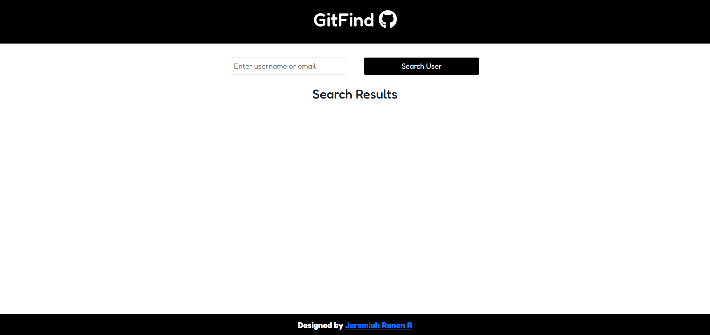

# GitFind

GitFind is a simple web application that allows users to search for GitHub users by username or email. It utilizes the GitHub API to fetch user data and display it in a user-friendly interface.



## Features

- **Search by Username or Email**: Users can enter a GitHub username or email address in the search bar to find users.
- **Clickable User Results**: Search results display clickable user profiles that open in a new tab.
- **Responsive Design**: The application is designed to work well on both desktop and mobile devices.

## Technologies Used

- **React**: The frontend is built using React, a popular JavaScript library for building user interfaces.
- **CSS**: Styling is done using CSS for layout and design.
- **GitHub API**: GitFind utilizes the GitHub API to fetch user data based on search queries.

## Installation

To run GitFind locally, follow these steps:

1. Clone the repository:

```bash
git clone https://github.com/your-username/GitFind.git
```

2. Navigate to the project directory:

```bash
cd GitFind
```

3. Install dependencies:

```bash
npm install
```

4. Start the development server:

```bash
npm start
```

5. Open your browser and navigate to `http://localhost:3000` to view the application.

## Contributing

Contributions are welcome! If you'd like to contribute to GitFind, please follow these steps:

1. Fork the repository.
2. Create a new branch for your feature or bug fix: `git checkout -b feature-name`.
3. Make your changes and commit them: `git commit -m 'Add new feature'`.
4. Push to the branch: `git push origin feature-name`.
5. Submit a pull request detailing your changes.

## Acknowledgements

- The project was inspired by the need for a simple GitHub user search tool.
- Special thanks to the GitHub API for providing easy access to user data.
```
